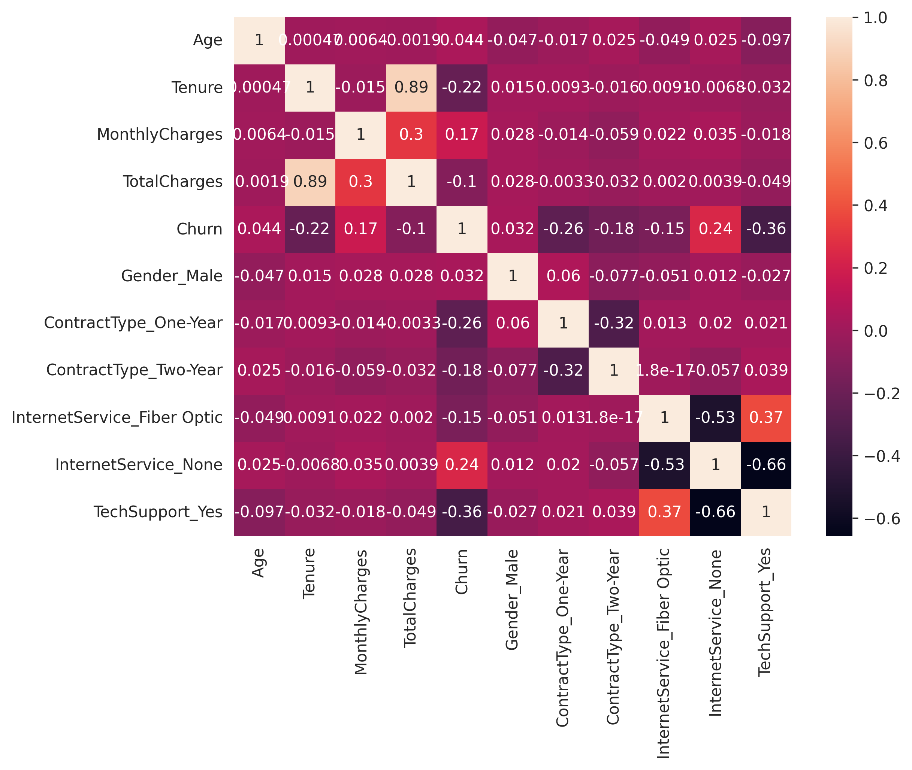
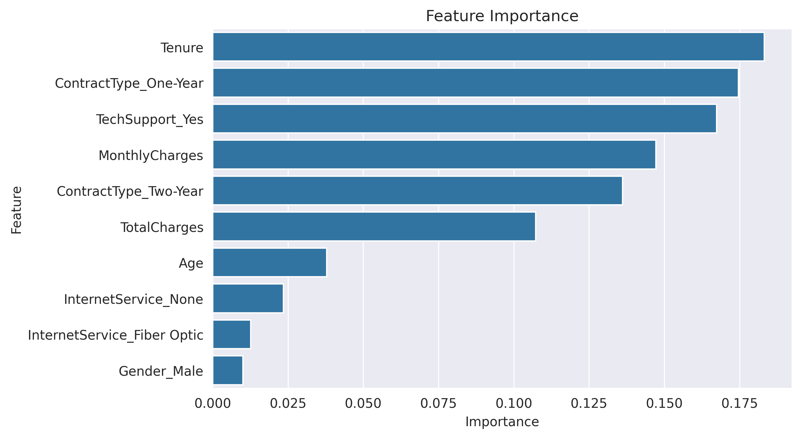
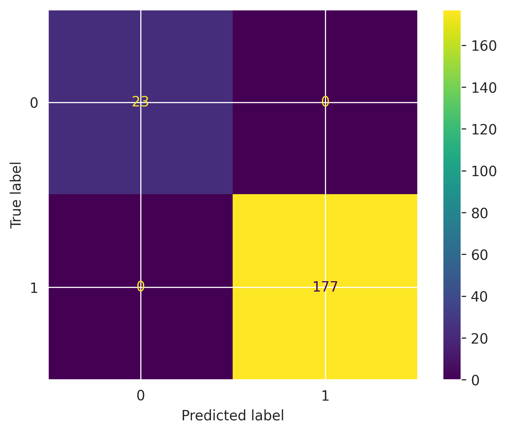
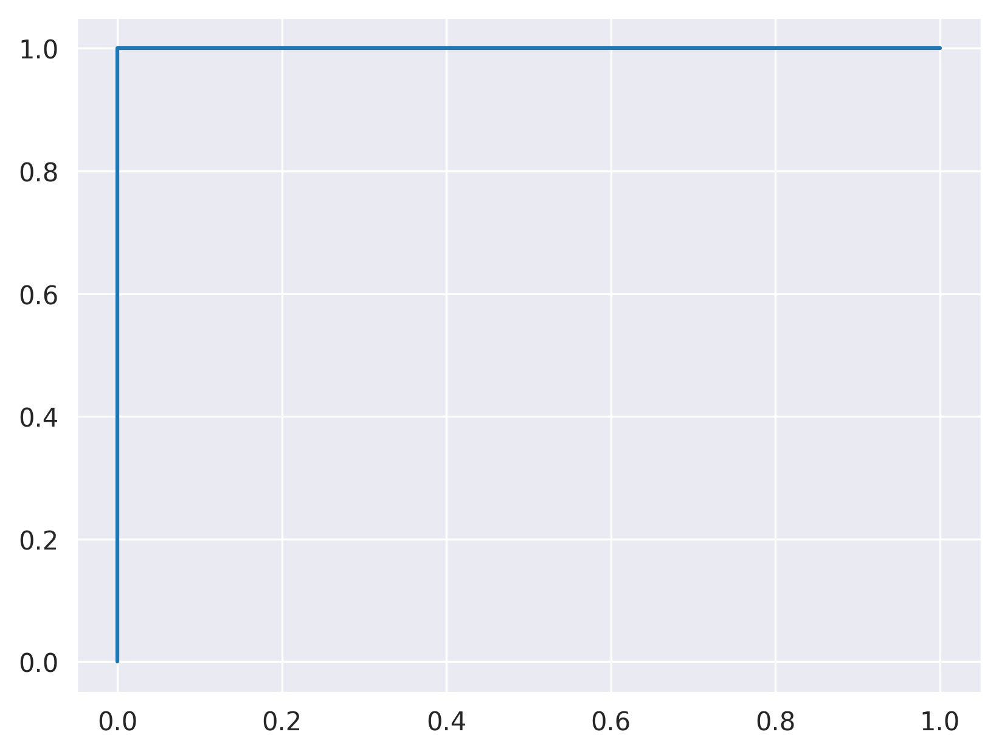

# 📊 Customer Churn Prediction using Machine Learning

## Live Demo 

🔗 Streamlit app : https://customer-churn-prediction-7iwqsksmym96lqomm56agc.streamlit.app/

---

## 📌 Project Overview

Customer churn is one of the most important business problems in subscription-based industries. Churn occurs when customers stop using a company's services, resulting in revenue loss and increased customer acquisition costs.

This project aims to predict customer churn using Machine Learning techniques. The workflow includes data preprocessing, exploratory data analysis (EDA), feature engineering, model building, model evaluation, and deployment using Streamlit.

---

## 🎯 Objectives

* Analyze customer behavior and identify factors contributing to churn.
* Build machine learning models to predict customer churn.
* Compare multiple classification algorithms.
* Deploy the best-performing model as an interactive web application.

---

## 📂 Dataset Information

The dataset contains customer demographic information, subscription details, billing information, and support-related features.

### Features Used

| Feature         | Description                       |
| --------------- | --------------------------------- |
| Age             | Customer age                      |
| Tenure          | Number of months as a customer    |
| MonthlyCharges  | Monthly subscription charges      |
| TotalCharges    | Total amount paid                 |
| Gender          | Customer gender                   |
| ContractType    | Subscription contract type        |
| InternetService | Type of internet service          |
| TechSupport     | Whether tech support is available |
| Churn           | Target variable                   |

---

# 🔍 Exploratory Data Analysis

## Correlation Heatmap

The correlation heatmap helps understand relationships among numerical features and their impact on churn.



### Key Findings

* Longer tenure is associated with lower churn.
* Customers with higher monthly charges tend to churn more frequently.
* Tech support significantly reduces churn probability.

---

## Feature Importance Analysis

Feature importance analysis identifies the most influential variables affecting customer churn.



### Top Influential Features

* Tenure
* Contract Type
* Tech Support
* Monthly Charges
* Total Charges

---

# ⚙️ Data Preprocessing

The following preprocessing steps were performed:

* Handling missing values
* Label encoding of target variable
* One-hot encoding of categorical features
* Feature selection
* Train-test splitting

---

# 🤖 Machine Learning Models

Three classification algorithms were implemented and compared:

### 1. Logistic Regression

A baseline linear classification model used for churn prediction.

### 2. Decision Tree Classifier

A tree-based model capable of capturing non-linear relationships.

### 3. Random Forest Classifier

An ensemble learning model that combines multiple decision trees to improve prediction accuracy and robustness.

---

# 📈 Model Evaluation

## Model Comparison

| Model               | Accuracy | Precision | Recall | F1-Score | ROC-AUC |
| ------------------- | -------- | --------- | ------ | -------- | ------- |
| Logistic Regression | 95.5%    | 0.95      | 0.95   | 0.95     | 0.985   |
| Decision Tree       | 99.5%    | 0.99      | 0.99   | 0.99     | 0.997   |
| Random Forest       | 100%     | 1.00      | 1.00   | 1.00     | 1.000   |

### Best Model

🏆 **Random Forest Classifier**

* Accuracy: 100%
* ROC-AUC: 1.000

---

## Confusion Matrix

The confusion matrix provides a detailed view of classification performance.



---

## ROC Curve

ROC Curve illustrates the trade-off between True Positive Rate and False Positive Rate.



---

# 🚀 Streamlit Deployment

An interactive Streamlit application was developed to allow users to predict customer churn in real time.

## Application Features

* User-friendly interface
* Real-time churn prediction
* Churn probability estimation
* Retention probability estimation
* Random Forest model integration

### Streamlit Application


---

# 🛠️ Technologies Used

* Python
* Pandas
* NumPy
* Matplotlib
* Seaborn
* Scikit-learn
* Joblib
* Streamlit

---

# 📁 Project Structure

```text
Customer-Churn-Prediction/
│
├── customer-churn-prediction.ipynb
├── customer_churn_model.pkl
├── app.py
├── requirements.txt
├── README.md
│
└── images/
    ├── correlation_heatmap.png
    ├── feature_importance.png
    ├── confusion_matrix.png
    ├── roc_curve.png
    └── streamlit_app.png
```

---

# ▶️ How to Run Locally

### Clone Repository

```bash
git clone https://github.com/your-username/Customer-Churn-Prediction.git
```

### Install Dependencies

```bash
pip install -r requirements.txt
```

### Run Streamlit App

```bash
streamlit run app.py
```

---

# 💡 Business Insights

* Customers with shorter tenure are more likely to churn.
* Contract type strongly influences customer retention.
* Providing technical support significantly reduces churn.
* Monthly charges impact customer retention behavior.

---

# 📌 Future Improvements

* Hyperparameter tuning using GridSearchCV.
* Cross-validation for improved robustness.
* Integration with cloud deployment services.
* Real-time database connectivity.
* Explainable AI using SHAP values.

---

# 👩‍💻 Author

**Tadisetti Sri Sai Rishita**

B.Tech Student | Machine Learning Enthusiast

---

⭐ If you found this project useful, consider giving it a star on GitHub.
